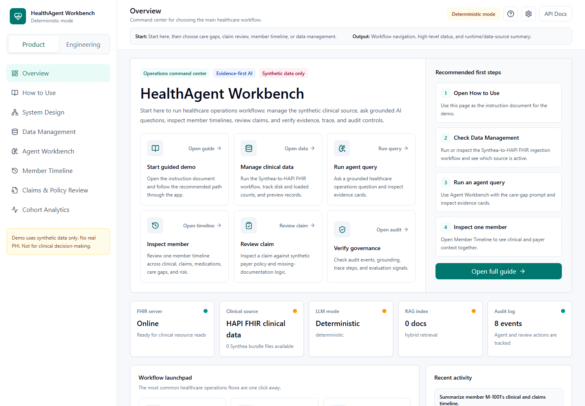
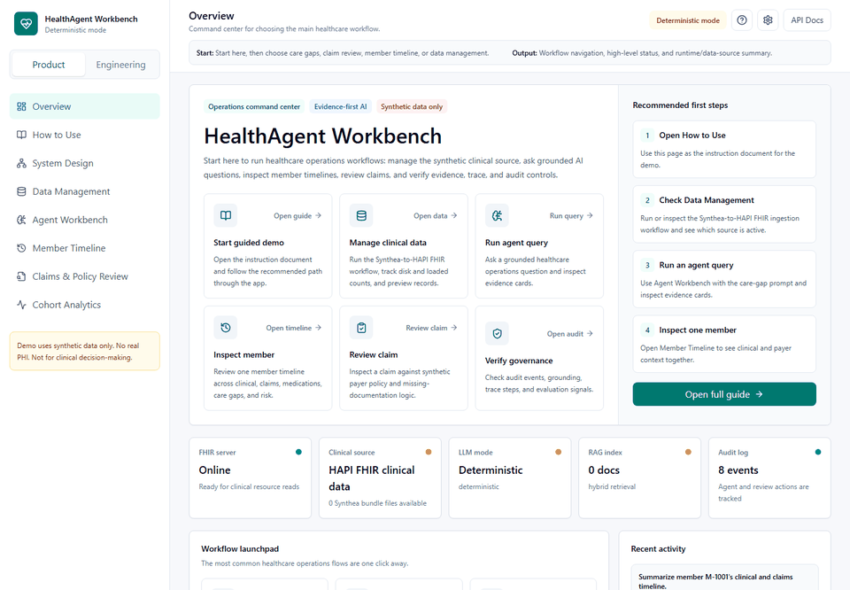
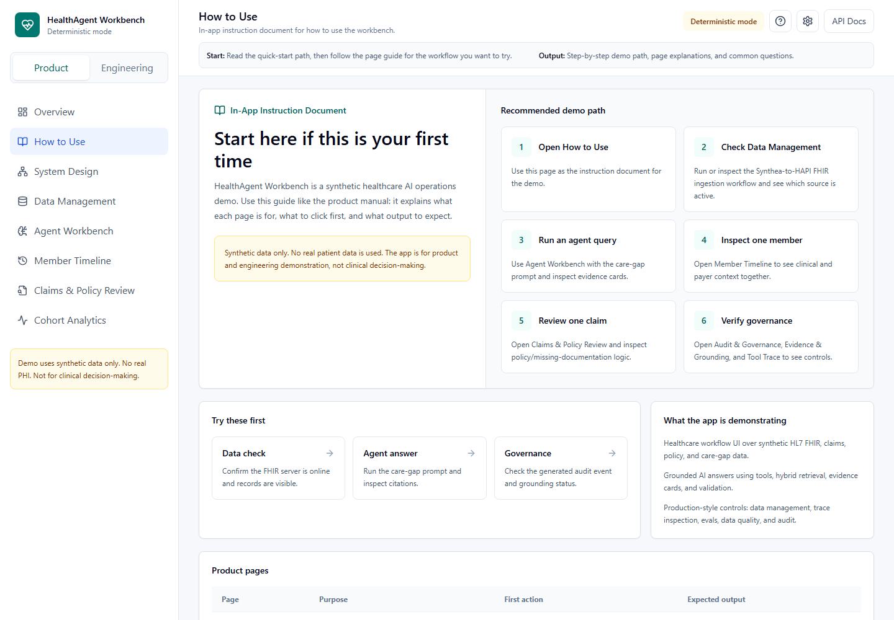
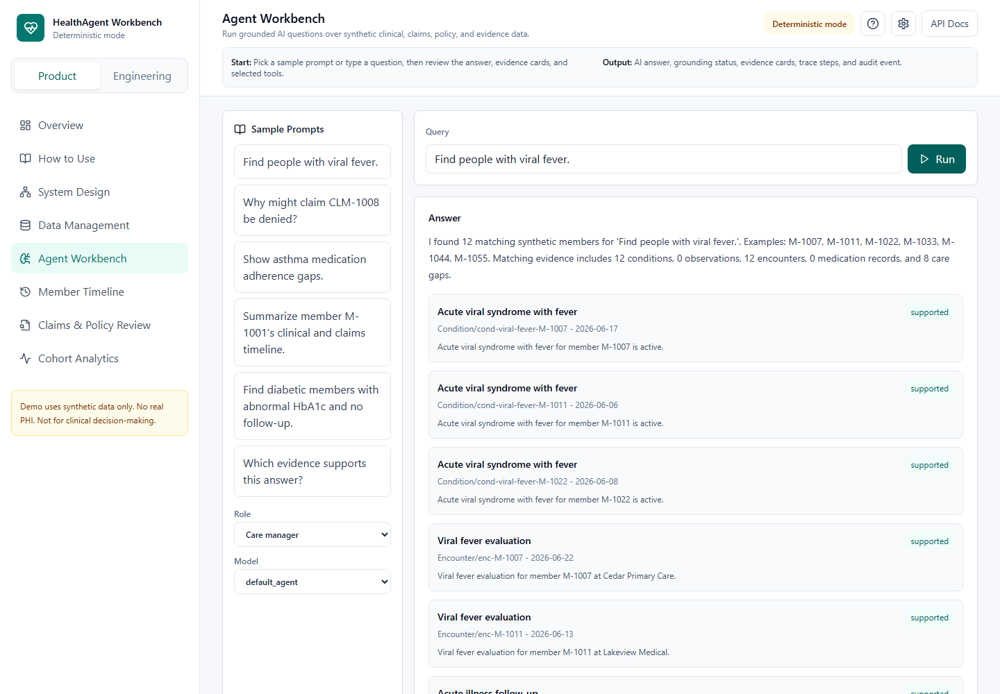
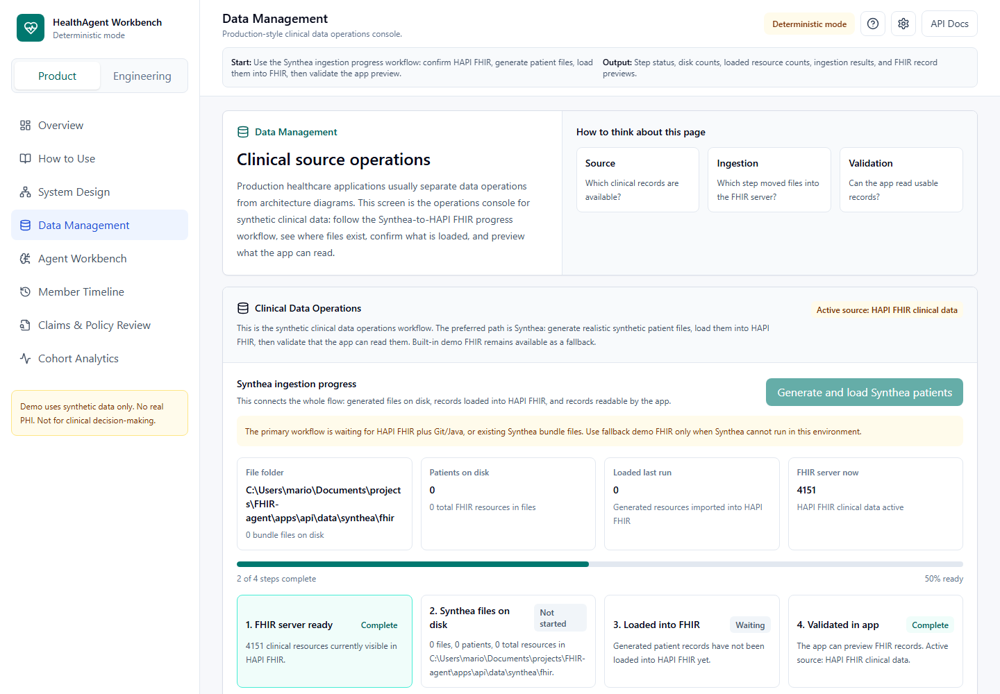
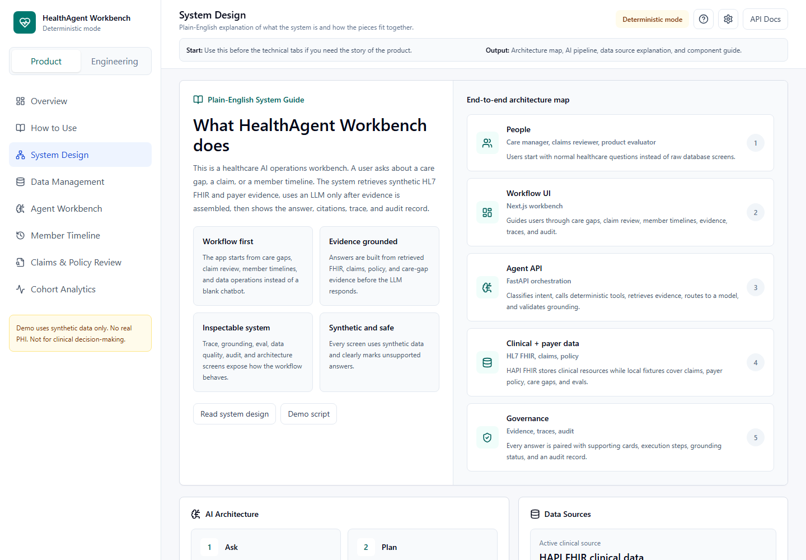

# HealthAgent Workbench


HealthAgent Workbench is a local healthcare AI engineering workbench for synthetic HL7 FHIR R4, claims, policy, and care-management workflows. It demonstrates grounded agent answers, evidence cards, tool traces, audit events, care-gap search, claim review, member timelines, Synthea/HAPI FHIR data loading, and hybrid RAG patterns.

This project uses synthetic data only. It contains no real PHI and is not for clinical decision-making.

## What It Does

- Finds synthetic members with care gaps such as viral fever follow-up, asthma medication adherence, diabetes HbA1c follow-up, hypertension, COPD, and preventive screening.
- Reviews synthetic claims against payer policy snippets and missing-documentation rules.
- Builds member timelines across clinical records, claims, medications, care gaps, and risk context.
- Shows evidence cards, trace steps, grounding status, and audit logs for agent answers.
- Supports local HAPI FHIR and Synthea-generated HL7 FHIR R4 bundles.
- Supports deterministic grounded answers by default, with optional Ollama or OpenAI answer composition.

## Screenshots





| Workflow | Preview |
| --- | --- |
| How to Use |  |
| Agent Workbench: viral fever query |  |
| Data Management |  |
| System Design |  |

## Tech Stack

- **Frontend:** Next.js, React, TypeScript, Tailwind CSS, Framer Motion, TanStack Query, React Flow, Recharts, Zustand, Lucide icons
- **Backend:** Python, FastAPI, Pydantic, SQLAlchemy
- **Data:** PostgreSQL, pgvector, Redis-ready worker scaffold, JSON fixtures
- **FHIR:** HL7 FHIR R4, HAPI FHIR, Synthea bundle generation/import
- **AI:** deterministic grounded mode, optional Ollama, optional OpenAI
- **Runtime:** Docker Compose

## Prerequisites

- Node.js 20+
- Python 3.12+
- Docker Desktop
- Git
- Java 17+ if you want to generate Synthea bundles locally
- Ollama if you want local LLM answer composition

## Quick Start

```bash
cp .env.example .env
python scripts/seed_demo_data.py
npm install
npm run typecheck
npm run build
docker compose up --build
```

Open:

- Web app: <http://localhost:3000>
- API docs: <http://localhost:8000/docs>
- HAPI FHIR: <http://localhost:8080/fhir>

## Run Without Docker

Use this when you only want to inspect or develop the web/API quickly.

Terminal 1:

```bash
python scripts/seed_demo_data.py
uvicorn app.main:app --app-dir apps/api --reload --host 0.0.0.0 --port 8000
```

Terminal 2:

```bash
npm install
npm run dev
```

## Environment

Start from [.env.example](.env.example).

Common local settings:

```bash
LLM_PROVIDER=ollama
OLLAMA_BASE_URL=http://host.docker.internal:11434
OLLAMA_MODEL=qwen3.5:9b
FHIR_BASE_URL=http://hapi-fhir:8080/fhir
USE_HAPI_FHIR=true
```

If no LLM provider is reachable, the app falls back to deterministic grounded answers.

## Optional OpenAI

To use OpenAI locally, keep the key in the ignored `.env` file:

```powershell
.\scripts\configure_openai.ps1
docker compose up --build
```

The script prompts for `OPENAI_API_KEY` and sets `LLM_PROVIDER=openai`.

## Optional Ollama

```bash
ollama pull qwen3.5:9b
docker compose up --build
```

## Optional Synthea

Generate Synthea FHIR R4 bundles:

```bash
python scripts/generate_synthea.py --patients 25
```

Generated bundles are written to `data/synthea/fhir/`. In the app, open **Data Management** to import them into HAPI FHIR and preview loaded resources.

## Useful Commands

```bash
npm run typecheck
npm run build
python -m compileall apps/api scripts
python scripts/seed_demo_data.py
python scripts/generate_synthea.py --patients 25
docker compose up --build
docker compose down
```

## API Areas

FastAPI exposes OpenAPI docs at <http://localhost:8000/docs>.

- Runtime/status: `/health`, `/api/settings/runtime`, `/api/architecture/status`
- Members/timelines: `/api/members`, `/api/members/{member_id}/timeline`
- FHIR/data management: `/api/fhir/status`, `/api/fhir/load-demo`, `/api/synthea/status`, `/api/synthea/generate`, `/api/synthea/import`
- RAG/agent: `/api/rag/status`, `/api/rag/reindex`, `/api/rag/search`, `/api/agent/query`
- Claims/analytics/evals: `/api/claims`, `/api/analytics/care-gaps`, `/api/analytics/risk-scores`, `/api/evals/results`
- Governance: `/api/data-quality/report`, `/api/audit/events`

## Project Structure

```text
apps/api/        FastAPI backend, agent graph, tools, services, seed script
apps/web/        Next.js frontend
packages/shared/ Shared TypeScript types
data/synthetic/  Synthetic members, claims, policies, FHIR-shaped fixtures
infra/postgres/  PostgreSQL/pgvector initialization
scripts/         Local setup, OpenAI config, and Synthea generation
docs/screenshots Screenshots used by this README
```

## Troubleshooting

If Docker cannot pull images, confirm Docker Desktop is running and WSL integration is installed/enabled.

If HAPI FHIR is not ready yet, wait for the container to finish starting and refresh Data Management.

If Synthea generation fails, confirm Java and Git are available in the environment running the script.

If an LLM provider fails, use deterministic mode or verify `LLM_PROVIDER`, `OPENAI_API_KEY`, `OLLAMA_BASE_URL`, and `OLLAMA_MODEL`.
